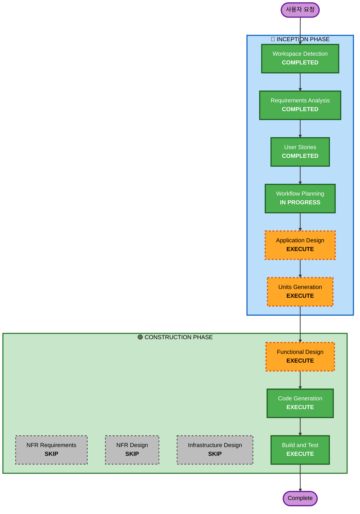

# Execution Plan — 테이블오더 서비스

## Detailed Analysis Summary

### Change Impact Assessment
- **User-facing changes**: Yes — 고객 주문 UI, 관리자 대시보드 신규 구축
- **Structural changes**: Yes — 3개 애플리케이션 (백엔드 + 프론트엔드 2개) 신규 아키텍처
- **Data model changes**: Yes — 매장, 테이블, 메뉴, 주문, 세션 등 전체 데이터 모델 신규 설계
- **API changes**: Yes — REST API + SSE 엔드포인트 전체 신규 설계
- **NFR impact**: No — 보안 확장 미적용, 로컬 개발 환경 우선

### Risk Assessment
- **Risk Level**: Medium — 멀티테넌트 + 실시간 통신(SSE) + 세션 관리의 복합 복잡도
- **Rollback Complexity**: Easy — Greenfield 프로젝트
- **Testing Complexity**: Moderate — 단위 + 통합 테스트, SSE 실시간 테스트 필요

---

## Workflow Visualization



Text Alternative:
```
INCEPTION PHASE:
  1. Workspace Detection    [COMPLETED]
  2. Requirements Analysis  [COMPLETED]
  3. User Stories           [COMPLETED]
  4. Workflow Planning      [IN PROGRESS]
  5. Application Design     [EXECUTE]
  6. Units Generation       [EXECUTE]

CONSTRUCTION PHASE:
  7. Functional Design      [EXECUTE] (per-unit)
  8. NFR Requirements       [SKIP]
  9. NFR Design             [SKIP]
  10. Infrastructure Design [SKIP]
  11. Code Generation       [EXECUTE] (per-unit)
  12. Build and Test        [EXECUTE]
```

---

## Phases to Execute

### 🔵 INCEPTION PHASE
- [x] Workspace Detection (COMPLETED)
- [x] Requirements Analysis (COMPLETED)
- [x] User Stories (COMPLETED)
- [x] Workflow Planning (IN PROGRESS)
- [ ] Application Design - EXECUTE
  - **Rationale**: 3개 애플리케이션의 컴포넌트 구조, 서비스 레이어, API 설계가 필요
- [ ] Units Generation - EXECUTE
  - **Rationale**: 백엔드/고객 프론트엔드/관리자 프론트엔드 3개 유닛으로 분해 필요

### 🟢 CONSTRUCTION PHASE (Per-Unit)
- [ ] Functional Design - EXECUTE
  - **Rationale**: 주문 라이프사이클, 세션 관리, 멀티테넌트 등 복잡한 비즈니스 로직 상세 설계 필요
- [ ] NFR Requirements - SKIP
  - **Rationale**: 보안 확장 미적용(Q11: B), 로컬 개발 환경 우선(Q4: D)
- [ ] NFR Design - SKIP
  - **Rationale**: NFR Requirements 건너뛰므로 해당 없음
- [ ] Infrastructure Design - SKIP
  - **Rationale**: 배포 환경 미정, 로컬 개발 환경만 우선 구성
- [ ] Code Generation - EXECUTE (항상)
  - **Rationale**: 실제 코드 구현 필요
- [ ] Build and Test - EXECUTE (항상)
  - **Rationale**: 빌드 및 테스트 지침 필요 (단위 + 통합 테스트)

### 🟡 OPERATIONS PHASE
- [ ] Operations - PLACEHOLDER
  - **Rationale**: 향후 배포/모니터링 워크플로우 확장 예정

---

## Success Criteria
- **Primary Goal**: 멀티테넌트 테이블오더 서비스 MVP 구현
- **Key Deliverables**:
  - NestJS 백엔드 API 서버 (REST + SSE)
  - React 고객용 웹 앱
  - React 관리자용 웹 앱
  - MySQL 데이터베이스 스키마
  - 단위 테스트 + 통합 테스트
- **Quality Gates**:
  - 모든 사용자 스토리의 Acceptance Criteria 충족
  - 단위 테스트 + 통합 테스트 통과
  - SSE 실시간 통신 2초 이내 동작
